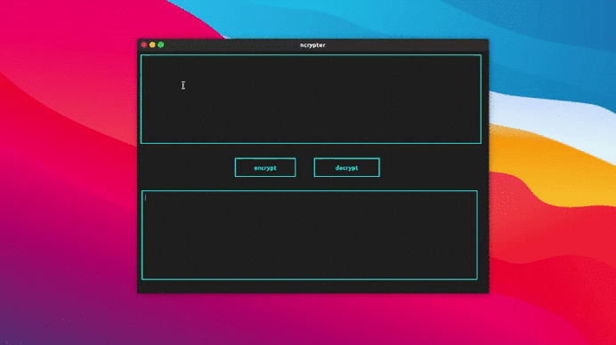

# nCrypter-GUI
simple text encryption program with Qt GUI 

---


N-Crypter is simple standalone Text encryption/decryption tool
wriiten in GCC C++


> note :this is a simple encrypter anyone with source code could simply decrypt it !

this is a fun project , sorry for bugs


### Prerequsties
---
> g++ &
> python(optional)
>Qt Widget Library 

### How this works

this program simply change every text to its ASCII value and change that ASCII value and reconverting to Text

```cpp


```

the decryption is also work in almost same way the only change is while encryption
convert the charecter to next ones decrytion converts it to previous one

